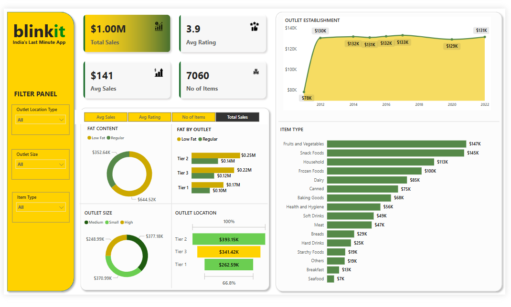

# 🛒 Blinkit Sales Analysis 📊

A comprehensive sales analysis project using **Power BI**, **SQL**, and **Python** on Blinkit (an Indian quick-commerce platform) data. This project aims to extract business insights, identify patterns, and improve decision-making through data visualization and analysis.

---

## 📌 Objective

To analyze the sales performance of Blinkit using real-world data and uncover actionable insights on revenue, top-selling items, customer behavior, and more.
- Analyze item-wise and outlet-wise sales performance
- Study customer behavior using ratings and sales distribution
- Evaluate sales trends by outlet type, size, and location
- Create a clean and interactive dashboard for business stakeholders


---

## 🛠️ Tools & Technologies

- **SQL** – For data extraction and transformation (ETL).
- **Power BI** – For creating interactive dashboards and data visualizations.
- **Python (Pandas, Matplotlib, Seaborn)** – For data cleaning, EDA (Exploratory Data Analysis), and preprocessing.
- **Jupyter Notebook** – For documenting the data analysis process.

---

## 📂 Project Structure

```plaintext
Blinkit-Sales-Analysis/
│
├── BlinkIT_Data.csv
├── Blinkit Analysis in Python.ipynb
├── Blinkit_dashboard.pbix
├── Dashboard_Screenshot.png
├── queries.sql
└── README.md
```
--
## Dashboard Screenshot

---


## 📈 Key Metrics

| Metric                     | Value     |
|---------------------------|-----------|
| 💰 Total Sales             | $1.00M    |
| 📊 Average Sales           | $141      |
| 🛒 Number of Items         | 7060      |
| 🌟 Average Rating          | 3.9       |

---

## 🏪 Outlet Insights

- **Top Performing Outlet Size:** Medium size outlets
- **Top Location Type:** Tier 2 cities contributed the most to revenue
- **Outlet Establishment:** Peak outlet revenue in 2012–2015, stable afterward

---

## 🥗 Product Insights

### 🔸 By Fat Content
- Regular fat items brought in **$644K+**
- Low fat items accounted for **$352K+**

### 🔸 By Item Type (Top Performers)
- Fruits & Vegetables: $147K
- Snack Foods: $145K
- Household Products: $113K

---


## 💡 Business Insights

- Focus on stocking **fruits, vegetables, and snack foods**
- Consider expanding **Tier 2** and **medium-sized outlets**
- Regular fat products have higher sales—optimize inventory accordingly
- Outlet expansion shows early success (2012–2014); explore similar strategies

---


